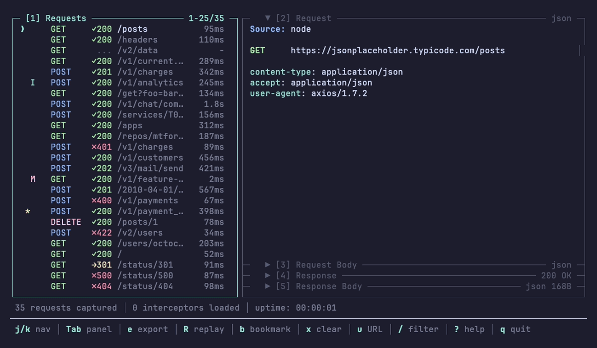

# httap

[](https://www.npmjs.com/package/httap)
[](https://github.com/mtford90/httap/actions/workflows/ci.yml)
[](https://opensource.org/licenses/MIT)

Httap is a terminal-based, project-scoped HTTP proxy with a powerful CLI, TUI & MCP server. Quickly intercept, inspect & rewrite HTTP traffic from the comfort of your terminal or favourite AI agent.



## Feature Highlights

- **Project-scoped** — each project gets its own `.httap/` directory with a separate daemon, database, CA cert and interceptors
- **MCP server** — AI agents get full access to your captured traffic and can search, filter, inspect, mock — all via tool calls.
- **Interceptors** — mock, modify or observe traffic by writing typescript. Agent can do this over MCP meaning you can express complex scenarios in natural language!

## Quick Start

```bash
npm install -g @mtford/httap

# Configure environment e.g. HTTP_PROXY
eval "$(httap on)"

# Send a request
curl https://api.example.com/users

# Open UI
httap tui

# Add MCP server to your AI tool
claude mcp add httap -- httap mcp
```

## Browser Interception

Launch any browser pre-configured to route through httap — no manual proxy setup, no certificate warnings:

```bash
# Auto-detect and launch your default browser
httap browser

# Open a specific URL
httap browser https://example.com

# Choose a specific browser
httap browser --browser firefox
httap browser --browser brave
```

Each browser session gets its own isolated profile and is automatically attributed in the TUI (e.g. `source: chrome`). Close the browser or press `Ctrl+C` to stop — the temp profile is cleaned up automatically.

**Supported browsers:**

| Engine   | Browsers                                    |
| -------- | ------------------------------------------- |
| Chromium | Chrome, Brave, Edge, Vivaldi, Arc, Chromium |
| Firefox  | Firefox, Zen Browser, LibreWolf             |

## Project Scoping

httap doesn't use a global system proxy. Each project gets its own `.httap/` directory in the project root (detected by `.git` or an existing `.httap/`):

```
your-project/
├── .httap/
│   ├── interceptors/   # TypeScript interceptor files
│   ├── config.json     # Optional project config
│   ├── proxy.port      # Proxy TCP port
│   ├── control.sock    # IPC socket
│   ├── requests.db     # Captured traffic
│   ├── ca.pem          # CA certificate
│   └── daemon.pid      # Process ID
└── src/...
```

Separate daemon, database, certificates etc. You can run httap in multiple projects at the same time without them interfering with each other.

For non-project contexts or custom setups, use `--config` to point directly at a data directory (no `.httap` appended):

```bash
httap --config /tmp/my-httap-data on
```

See [CLI Reference](docs/cli-reference.md) for the full resolution order (`--config` > `--dir` > auto-detect).

## MCP Integration

httap has a built-in [MCP](https://modelcontextprotocol.io/) server that gives AI agents full access to your captured traffic and interceptor system.

### Setup

**Claude Code:**

```bash
claude mcp add httap -- httap mcp
```

**Codex:**

```bash
codex mcp add httap -- httap mcp
```

**Cursor** — add to `.cursor/mcp.json`:

```json
{
  "mcpServers": {
    "httap": {
      "command": "httap",
      "args": ["mcp"]
    }
  }
}
```

**Other MCP clients** (Windsurf, etc.) — add to your client's MCP config:

```json
{
  "mcpServers": {
    "httap": {
      "command": "httap",
      "args": ["mcp"]
    }
  }
}
```

The proxy must be running (`eval "$(httap on)"`) — the MCP server connects to the same daemon as the TUI.

### Available Tools

| Tool                       | Description                                          |
| -------------------------- | ---------------------------------------------------- |
| `httap_get_status`          | Daemon status, proxy port, request count             |
| `httap_list_requests`       | Search and filter captured requests                  |
| `httap_get_request`         | Full request details by ID (headers, bodies, timing) |
| `httap_search_bodies`       | Full-text search through body content                |
| `httap_query_json`          | Extract values from JSON bodies via JSONPath         |
| `httap_count_requests`      | Count matching requests                              |
| `httap_clear_requests`      | Delete all captured requests                         |
| `httap_list_sessions`       | List active proxy sessions                           |
| `httap_list_interceptors`   | List loaded interceptors with status and errors      |
| `httap_reload_interceptors` | Reload interceptors from disk                        |

See [full MCP documentation](docs/mcp.md) for filtering, output formats, and examples.

## Interceptors

TypeScript files in `.httap/interceptors/` that intercept HTTP traffic as it passes through the proxy. They can return mock responses, modify upstream responses, or just observe.

```typescript
import type { Interceptor } from "@mtford/httap/interceptors";

export default {
  name: "mock-users",
  match: (req) => req.path === "/api/users",
  handler: async () => ({
    status: 200,
    headers: { "content-type": "application/json" },
    body: JSON.stringify([{ id: 1, name: "Alice" }]),
  }),
} satisfies Interceptor;
```

See [full interceptors documentation](docs/interceptors.md) for modify, observe, querying past traffic, handler context, and how they work.

## How It Works

```
┌─────────────────────────────────────────────────────────────┐
│  Your Shell                                                 │
│  ┌─────────────────────────────────────────────────────┐   │
│  │  curl, wget, node, python...                        │   │
│  │          │                                          │   │
│  │          ▼                                          │   │
│  │  HTTP_PROXY=localhost:54321                         │   │
│  └─────────────────────────────────────────────────────┘   │
│                          │                                  │
└──────────────────────────┼──────────────────────────────────┘
                           ▼
┌─────────────────────────────────────────────────────────────┐
│  httap daemon                                                │
│  ┌─────────────┐    ┌─────────────┐    ┌─────────────┐     │
│  │ MITM Proxy  │───▶│   SQLite    │◀───│ Control API │     │
│  │  (mockttp)  │    │  requests   │    │ (unix sock) │     │
│  └─────────────┘    └─────────────┘    └─────────────┘     │
└─────────────────────────────────────────────────────────────┘
                           ▲
                           │
┌──────────────────────────┼──────────────────────────────────┐
│  httap tui                │                                  │
│  ┌───────────────────────┴─────────────────────────────┐   │
│  │ ● POST /api/users   │ POST https://api.example.com  │   │
│  │   GET  /health      │ Status: 200 │ Duration: 45ms  │   │
│  │   POST /login       │                               │   │
│  │                     │ Request Headers:              │   │
│  │                     │   Content-Type: application/  │   │
│  └─────────────────────┴───────────────────────────────┘   │
└─────────────────────────────────────────────────────────────┘
```

`eval "$(httap on)"` starts a daemon, sets `HTTP_PROXY`/`HTTPS_PROXY` in your shell, and captures everything that flows through. `eval "$(httap off)"` unsets them. The TUI connects to the daemon via Unix socket.

### Environment Variables

`eval "$(httap on)"` sets these in your shell (`eval "$(httap off)"` unsets them):

| Variable              | Purpose                              |
| --------------------- | ------------------------------------ |
| `HTTP_PROXY`          | Proxy URL for HTTP clients           |
| `HTTPS_PROXY`         | Proxy URL for HTTPS clients          |
| `SSL_CERT_FILE`       | CA cert path (curl, OpenSSL)         |
| `REQUESTS_CA_BUNDLE`  | CA cert path (Python requests)       |
| `CURL_CA_BUNDLE`      | CA cert path (curl/Python fallback)  |
| `NODE_EXTRA_CA_CERTS` | CA cert path (Node.js)               |
| `DENO_CERT`           | CA cert path (Deno)                  |
| `CARGO_HTTP_CAINFO`   | CA cert path (Rust Cargo)            |
| `GIT_SSL_CAINFO`      | CA cert path (Git)                   |
| `AWS_CA_BUNDLE`       | CA cert path (AWS CLI)               |
| `CGI_HTTP_PROXY`      | Proxy URL (PHP CGI, HTTPoxy-safe)    |
| `HTTAP_SESSION_ID`     | UUID identifying the current session |
| `HTTAP_LABEL`          | Session label (when `-l` flag used)  |

Additionally, `httap on` sets `PYTHONPATH`, `RUBYOPT`, and `PHP_INI_SCAN_DIR` to load runtime-specific override scripts that ensure edge-case HTTP clients trust the proxy CA.

## Configuration

Create `.httap/config.json` to override defaults:

```json
{
  "maxStoredRequests": 5000,
  "maxBodySize": 10485760,
  "maxLogSize": 10485760,
  "pollInterval": 2000
}
```

See [full configuration documentation](docs/configuration.md) for details on each setting.

## Supported HTTP Clients

Anything that respects `HTTP_PROXY` works. httap sets the right CA cert env vars for each runtime automatically.

**Works automatically (env vars only):**

| Client              | Support                         |
| ------------------- | ------------------------------- |
| curl                | Automatic                       |
| wget                | Automatic                       |
| Go (`net/http`)     | Automatic                       |
| Rust (reqwest)      | Automatic                       |
| .NET (`HttpClient`) | Automatic                       |
| Deno                | Automatic (`DENO_CERT`)         |
| Bun                 | Automatic (`SSL_CERT_FILE`)     |
| Git                 | Automatic (`GIT_SSL_CAINFO`)    |
| AWS CLI             | Automatic (`AWS_CA_BUNDLE`)     |
| Cargo               | Automatic (`CARGO_HTTP_CAINFO`) |

**Works with httap overrides (injection scripts):**

| Client                       | Mechanism                               |
| ---------------------------- | --------------------------------------- |
| Node.js (fetch, axios, etc.) | `NODE_OPTIONS --require` preload script |
| Python (requests, httplib2)  | `PYTHONPATH` sitecustomize.py           |
| Ruby (Net::HTTP, gems)       | `RUBYOPT -r` OpenSSL CA patch           |
| PHP (curl, streams)          | `PHP_INI_SCAN_DIR` custom INI           |

**Not currently supported (needs system-level config):**

| Runtime       | Reason                                       |
| ------------- | -------------------------------------------- |
| Java/JVM      | Needs `-javaagent` or JVM trust store config |
| Swift         | Uses macOS Keychain only                     |
| Dart/Flutter  | Requires code changes for proxy              |
| Elixir/Erlang | Requires code changes for proxy              |

## TUI

`j`/`k` to navigate, `Tab` to switch panels, `/` to filter, `e` to export, `Enter` to inspect bodies, `q` to quit. Mouse support included.

See [full TUI documentation](docs/tui.md) for all keybindings and export features.

## Documentation

- [CLI Reference](docs/cli-reference.md) — all commands, flags, and examples
- [Interceptors](docs/interceptors.md) — mock, modify, observe, query traffic, handler context
- [MCP Integration](docs/mcp.md) — tools, filtering, output formats, examples
- [TUI](docs/tui.md) — keybindings, export features
- [Configuration](docs/configuration.md) — `.httap/config.json` options

## Development

```bash
git clone https://github.com/mtford90/httap.git
cd httap
npm install

npm run build        # Compile TypeScript
npm test             # Run all tests
npm run typecheck    # Type checking only
npm run lint         # ESLint
npm run dev          # Watch mode
```

## Troubleshooting

### Certificate errors

httap sets common CA environment variables automatically, but some tools need manual configuration:

```bash
cat .httap/ca.pem
```

### Daemon won't start

Check if something else is using the socket:

```bash
httap status
httap daemon stop
eval "$(httap on)"
```

### Requests not appearing

Your HTTP client needs to respect proxy environment variables.

There are workarounds implemented for node - e.g. fetch override. Other libraries in different environments may need a similar treatment.

## Acknowledgements

httap is built on top of [MockTTP](https://github.com/httptoolkit/mockttp) by [Tim Perry](https://github.com/pimterry), the same MITM proxy engine that powers [HTTP Toolkit](https://httptoolkit.com/).

## Licence

MIT
